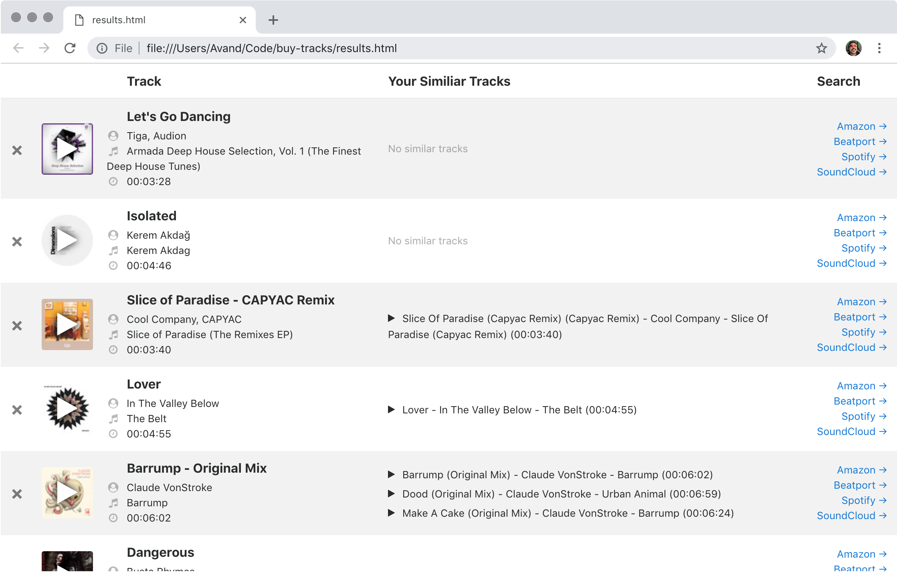

# Trackquisition



The basic idea behind this software library is to make it easier to purchase music. Everyone has different workflows. Buy Tracks works well if you acquire music like this:

1. You manage playlists on Spotify
1. You periodically want to buy tracks from certain playlists
1. You want to avoid buying the same track twice (maybe you share a library)
1. You want to quickly search for, add tracks to a cart, and checkout (without typing the song names a bajillion times)

Buy Tracks is a command line tool that generates an HTML file you can open on your computer and use to search for and buy tracks more easily.

I hope you like it!

# Installation

1. Clone this repo to your Mac
1. Run `bin/init` (from within the repo folder or just `init` if `./bin` is in your `$PATH`)
1. Edit `config.yml` (head over to Spotify and create a Client ID)

# Usage

Run `bin/acquire` passing in the name of the Spotify playlist you want to buy the tracks for. Like this:

```
trackquisition $> bin/acquire -p 'Disco Beats'
```

Run `bin/acquire` without any args or with the `-h` arg to get usage help.

# How it Works

Under the hood, Buy Tracks scans all the MP3s in your tracks directory. It generates a unique signature for each file based on the track name and duration. It's a bit fuzzy so it can compare against Spotify and see if there's anything close. For example, "Difficult to Love - Amtrac Remix" is 6 minutes and 29 seconds. The signature for that track might end up being something like "diffi-390," which would match anything in your library that has a similar title and length. It works pretty well to avoid buying the same track twice.
